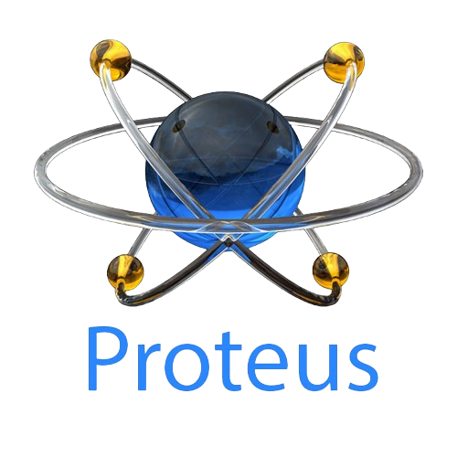

<!---
Readme Typing SVG: https://readme-typing-svg.herokuapp.com/demo/?pause=750&color=2CF74C&lines=Hi%E2%9C%8C%F0%9F%8F%BB
--->

Hi there! I'm [**Rahulkrishy**](https://github.com/rahulkrishy), a tech enthusiast passionate about embedded systems and programming.  

I love diving into both software and hardware, fusing them together to craft new ideas and innovative solutions. My goal is to develop technologies that elevate the quality of life and contribute to the betterment of society.

I document my tech learnings on GitHub using the CPT `(Concepts-Practice-Tasks)` method, organizing my work into Concepts, Practices, and Tasks for structured learning. I hope it will guide you on your journey, tech explorers!

Look out for exciting updates ahead and until then, always stay curious...Greets!✌🚀

---

|  🏗️           |   📊   |
| ------------- | -------|
| Tech Stack     Tools    |   |

<!---
GitHub stats: https://github.com/anuraghazra/github-readme-stats
--->

---

<!---
Visitors Count: https://visitcount.itsvg.in/
--->

